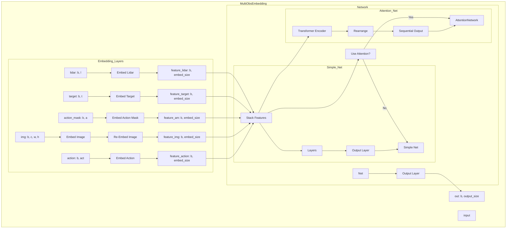

# HOPE: A Reinforcement Learning-based Hybrid Policy Path Planner for Diverse Parking Scenarios




This repository contains code for the paper [HOPE: A Reinforcement Learning-based Hybrid Policy Path Planner for Diverse Parking Scenarios](https://arxiv.org/abs/2405.20579). This work proposes a novel solution to the path-planning task in parking scenarios. The planner integrates a reinforcement learning agent with Reeds-Shepp curves, enabling effective planning across diverse scenarios. HOPE guides the exploration of the reinforcement learning agent by applying an action mask mechanism and employs a transformer to integrate the perceived environmental information with the mask. Our approach achieved higher planning success rates compared with typical rule-based algorithms and traditional reinforcement learning methods, especially in challenging cases.

## Examples
### Simulation cases


### Realworld demo
[https://www.youtube.com/watch?v=62w9qhjIuRI](https://www.youtube.com/watch?v=62w9qhjIuRI)


## Setup
1. Install conda or miniconda

2. Clone the repo and build the environment
```Shell
git clone https://github.com/jiamiya/HOPE.git
cd HOPE
conda create -n HOPE python==3.8
conda activate HOPE
pip3 install -r requirements.txt -i https://pypi.tuna.tsinghua.edu.cn/simple
```
and install pytorch from [https://pytorch.org/](https://pytorch.org/).

## Usage
### Run a pre-trained agent
```Shell
cd src

python ./evaluation/eval_mix_scene.py ./model/ckpt/HOPE_SAC0.pt --eval_episode 10 --visualize True

python ./evaluation/eval_mix_scene.py ./model/ckpt/HOPE_PPO.pt --eval_episode 50 --visualize True
```
You can find some other pre-trained weights in ``./src/model/ckpt``.

### Train the HOPE planner
```Shell
cd src
python ./train/train_HOPE_sac.py
```
or
```Shell
python ./train/train_HOPE_ppo.py
```

## Citation
If you find our work useful, please cite us as
```bibtex
@article{jiang2024hope,
  title={HOPE: A Reinforcement Learning-based Hybrid Policy Path Planner for Diverse Parking Scenarios},
  author={Jiang, Mingyang and Li, Yueyuan and Zhang, Songan and Chen, Siyuan and Wang, Chunxiang and Yang, Ming},
  journal={arXiv preprint arXiv:2405.20579},
  year={2024}
}
```
